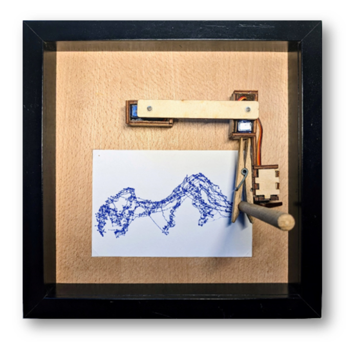
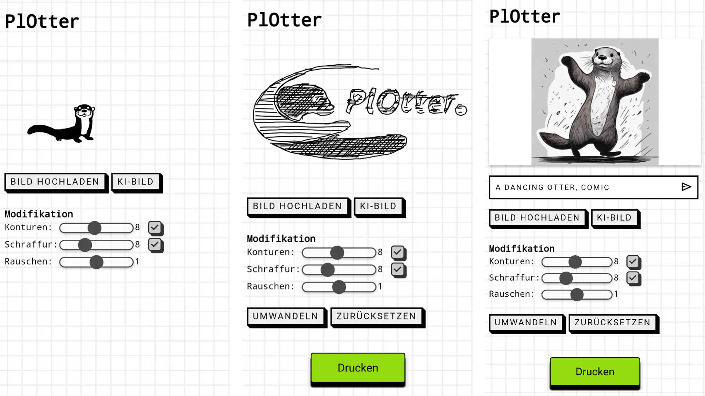

# PlOtter
Ein selbstmalender Bilderrahmen, der über eine intuitive Webseite gesteuert werden kann
<div>
  
</div>
<div>
  
</div>
# Materialien

| Material                    | Preis   |
|-----------------------------|---------|
| Raspberry Pi Zero W        | ca. 15 € |
| 10x Jumperkabel            | ca. 1 €  |
| 3x Micro Servos SG90       | ca. 9 €  |
| Bilderrahmen (je nach Typ) | ca. 15 € |
| Holz (je nach Art, inkl. Wäscheklammer) | ca. 3 € |
| **Gesamt**                  | **ca. 43 €** |

Andere Raspberry Pis werden auch unterstützt, der Raspberry Pi Zero genügt aber.

# Zusammenbau


# Software Einrichtung

## Raspberry Pi Imager herunterladen und Raspberry Pi OS Lite (32-bit) installieren

1. Lade die neueste Version vom Raspberry Pi Imager von [hier](https://www.raspberrypi.com/software/) auf deinen Computer herunter.
2. Wähle die Version Raspberry Pi OS Lite (32-bit).
3. Konfiguriere die Einstellungen:
   - Setze den Hostnamen auf "plotter".
   - Aktiviere SSH.
   - Setze einen Benutzernamen und ein Passwort.
   - Gib den Namen und das Passwort deines WLANs unter "Wifi einrichten" ein.
4. Speichere die Konfiguration und schreibe sie auf eine SD-Karte.

## Verbindung zum Raspberry Pi über SSH herstellen

1. Stecke die SD-Karte in den Raspberry Pi und schließe ihn an den Strom an.
2. Öffne das Terminal auf deinem Computer und führe folgenden Befehl aus, um eine SSH-Verbindung herzustellen:
   
   ```bash
   ssh benutzername@plotter
   ```
   Wenn hier nichts gefunden wird, dann musst du ```plotter``` mit der IP-Adresse des Raspberry Pi ersetzen. Diese findest du mit einem IP-Scanner wie der App Fing oder anderem.
3. Gib das zuvor vergebene Passwort ein

## Herunterladen der Dateien von GitHub und Installation der Pakete

1. Installiere git & pip:
   
   ```bash
    sudo apt install git
    sudo apt install python3-pip
   ```
   Wenn gefragt wird, ob du weitermachen willst ```Do you want to continue?``` bestätige immer mit ```y```
2. Klone das GitHub-Repository:
   
   ```bash
   git clone https://github.com/lidufhgosiuhfgkyfdjhpspdigh/PlOtter
3. Navigiere zum Projektverzeichnis:
   
   ```bash
   cd PlOtter
4. Erstelle eine virtuelle Umgebung:
   
   ```bash
   python3 -m venv env
5. Aktiviere die virtuelle Umgebung:
   
   ```bash
   source env/bin/activate
6. Installiere benötigte Pakete:
   
   ```bash
   sudo apt install authbind
   sudo touch /etc/authbind/byport/80
   sudo chmod 777 /etc/authbind/byport/80
   sudo apt-get install libopenblas-dev
   pip install -r requirements.txt
   ```
   Wenn gefragt wird, ob du weitermachen willst ```Do you want to continue?``` bestätige immer mit ```y```

7. Um die Webseite automatisch zu starten öffne die Datei rc.local:
   
   ```bash
   cd
   sudo nano /etc/rc.local
8. Und füge vor ```exit 0``` folgendes ein:
    
   ```bash
   sudo bash /home/pi/PlOtter/start_flask.sh
   ```
   Speichere es anschließend mit Ctrl + X; y und der Eingabetaste
9. Schlussendlich wird der Raspberry Pi neugestartet:
   ```bash
   sudo reboot
10. Um nun die Webseite zu öffnen gehe auf http://plotter bzw. http://deineIpAdresse


## Stable Diffusion/OpenAI Token hinzufügen, um Bilder zu erstellen

1. Hole den token für Stable Diffusion bzw OpenAI unter der jeweiligen Webseite
2. Öffne ```main.py```:
   
   ```bash
   sudo nano PlOtter/main.py
3. Für Stable Diffusion:
   
   ```bash
      headers = {
            "Accept": "application/json",
            "Content-Type": "application/json",
            "Authorization": "Bearer sk-yourapikey",
      }

   ```
   
   Für OpenAI musst du die Bibliothek von OpenAi installieren:
   
   ```bash
   cd PlOtter
   source env/bin/activate
   pip install openai
   ```
   
   Und den Teil von Stable Diffusion ausklammern und den OpenAI-Teil erscheinen lassen:
   
   ```bash
    try:
        '''
        prompt = request.args.get('prompt')
        if prompt is None:
            return jsonify({"error": "Kein Prompt"}), 400

        url = "https://api.stability.ai/v1/generation/stable-diffusion-xl-1024-v1-0/text-to-image"

        body = {
        "steps": 40,
        "width": 1024,
        "height": 1024,
        "seed": 0,
        "cfg_scale": 5,
        "samples": 1,
        "text_prompts": [
            {
            "text": prompt,
            "weight": 1
            },
            {
            "text": " ",
            "weight": -1
            }
        ],
        }

        headers = {
            "Accept": "application/json",
            "Content-Type": "application/json",
            "Authorization": "Bearer sk-yourapikey",
        }

        response = requests.post(
            url,
            headers=headers,
            json=body,
        )

        if response.status_code != 200:
            raise Exception("Non-200 response: " + str(response.text))

        data = response.json()

        image_data_list = []
        for i, image in enumerate(data["artifacts"]):
            image_data = image["base64"]
            image_data_list.append(image_data)

        return jsonify({"image_data_list": image_data_list})
        '''
        from openai import OpenAI

        # Ersetze YOUR_API_KEY mit deinem OpenAI-API-Schlüssel
        openai_client = OpenAI(api_key="sk-yourapikey")

        prompt_text = request.args.get('prompt', 'default_prompt')

        response = openai_client.images.generate(
            model="dall-e-3",
            prompt=prompt_text,
            size="1024x1024",
            quality="standard",
            n=1,
        )

        image_url = response.data[0].url

        # Lade das Bild herunter und speichere es lokal
        image_response = requests.get(image_url)
        image_data = base64.b64encode(image_response.content).decode('utf-8')

        # Return the image URL and the base64-encoded image data
        return jsonify({"image_data": image_data})
   ```
   
   Anschließend musst du den API-Key einsetzen:
   
   ```bash
   openai_client = OpenAI(api_key="sk-yourapikey")
   ```
# Erklärung
Der PlOtter läuft auf einem Raspberry Pi Zero W mit dem hauseigenen Betriebssystem Raspberry Pi OS. Darauf läuft wiederum ein Flask-Webserver der eine in HTML, CSS und JavaScript geschriebene Webseite betreibt. Dieser ruft, sobald ein Bild gezeichnet werden soll, die notwendigen Funktionen des „BrachioGraph“ in Python auf. Die Webseite des PlOtters lässt sich sehr leicht mit http://plotter auf jedem beliebigen Gerät aufrufen, auf ihr kann man ein Bild einfügen, es auf der Zeichenebene ausrichten und anschließend mit verschiedenen Parametern in Linien umwandeln. Dafür bietet eine Vorschau die Möglichkeit, wenn nötig die Parameter Schraffur, Konturen und Rauschen nochmals zu verstellen, um ein besseres Ergebnis zu erhalten. Wenn dies zufriedenstellend ist, so kann man es mit einem Knopfdruck zum „Zeichnen“ an den PlOtter senden. Eine weitere Option bietet außerdem die Erstellung eines Bildes nach den eigenen Ideen. Hierfür muss nur die eigene Bildidee in Worte gefasst werden, woraufhin die Bilder mit der API von Stability AI und dem Bildmodel Stable Diffusion XL oder alternativ auch mit DALL·E 3 von OpenAI erzeugt werden. 

# Danksagung
Wir danken Tammo & Jürgen bei der Begleitung unseres Projekte.
Außerdem den Projekten [BrachioGraph von evildmp](https://github.com/evildmp/BrachioGraph) und [plotterfun von mixtela](https://github.com/mitxela/plotterfun)
